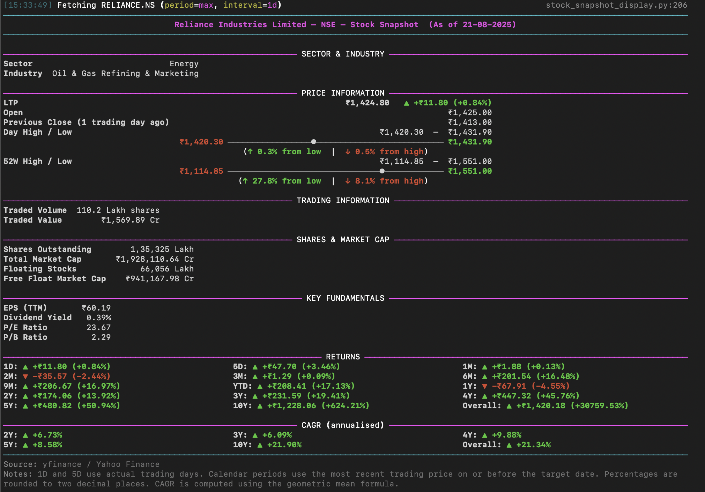

# Indian Stocks Snapshot Displayer

**Indian Stocks Snapshot Displayer** is a terminal-based, object-oriented Python utility that fetches market data for Indian exchange tickers (NSE / BSE) and prints a compact, easy-to-read “stock snapshot” report in the terminal. The tool uses Yahoo Finance as a data source (via `yfinance`) and renders the output using the `rich` library for clear, colored, tabular terminal output.

---

## Table of contents

- [Project overview](#project-overview)  
- [Features](#features)  
- [Key design goals](#key-design-goals)  
- [Quick start (install & run)](#quick-start-install--run)  
- [Usage examples](#usage-examples)  
- [Snapshot fields explained (plain language)](#snapshot-fields-explained-plain-language)  
- [Computation details & numerical correctness](#computation-details--numerical-correctness)  
- [Dependencies](#dependencies)  
- [Limitations, caveats and data disclaimers](#limitations-caveats-and-data-disclaimers)  
- [Troubleshooting & common questions](#troubleshooting--common-questions)  
- [Development, testing and contribution guidelines](#development-testing-and-contribution-guidelines)  
- [License & contact](#license--contact)

---

## Project overview

This project provides a small, portable command-line application that:

- Downloads historical prices and company metadata for a given stock symbol (NSE or BSE).
- Builds a concise snapshot containing price, volume, market-cap and common fundamental metrics.
- Computes recent returns (1 day, 1 month, 1 year, etc.) and annualised returns (CAGR).
- Prints a clear, human-readable report to the terminal using the `rich` library.

The tool is intended for reporting and research; it is not a trading platform.

---

## Features

- Fetches company metadata and historical OHLCV (Open, High, Low, Close, Volume) price data.
- Produces a terminal snapshot showing:
  - LTP (last traded/quoted price) with rupee and percent delta
  - Open, Previous Close
  - Day High / Low and a horizontal range bar with a marker
  - 52-week High / Low and its range bar
  - Trading volume and traded value
  - Shares outstanding, float, and market-cap estimates
  - Key fundamentals (EPS, Dividend Yield, P/E, P/B)
  - Recent returns (1D, 5D) and calendar returns (1M, 3M, 1Y, etc.)
  - Annualised returns (CAGR) for multi-year spans
- Uses `rich` for readable colored terminal output.

---

## Key design goals

1. **Accuracy** — Use adjusted close values where appropriate and a clear “on or before” logic for calendar-period returns to avoid holiday/weekend mismatches.  
2. **Readability** — Terminal output formatted for management review and quick interpretation (labels, aligned values, colored deltas, and compact range bars).  
3. **Robustness** — Fallbacks for missing metadata: prefer metadata but compute from history where necessary.  
4. **Explainability** — When a computation cannot be produced (e.g., insufficient history), the report includes a short, explicit reason.  
5. **Portable** — Single-file, CLI friendly; easy to run on common Python environments.

---

## Quick start (install & run)

1. Clone the repository:

```bash
git clone https://github.com/iammohith/Indian-Stocks-Snapshot-Displayer.git
cd Indian-Stocks-Snapshot-Displayer
```

2. Create and activate a Python virtual environment (recommended):

```bash
python3 -m venv .venv
source .venv/bin/activate       # macOS / Linux
# .venv\Scripts\activate         # Windows PowerShell
```

3. Install required packages:

```bash
pip install -r requirements.txt
```

If you want to install the core dependencies directly:

```bash
pip install yfinance pandas python-dateutil rich
```

4. Run the tool:

```bash
python stock_snapshot_display.py --exchange NSE --ticker RELIANCE
```

The tool will fetch data from Yahoo Finance and render the snapshot in your terminal.

---

## Usage examples

Basic usage:

```bash
python stock_snapshot_display.py --exchange NSE --ticker RELIANCE
```

Verbose mode with explanations for missing computations:

```bash
python stock_snapshot_display.py --exchange NSE --ticker TCS --verbose --show-missing-reasons
```

Specify a narrower history window for quick testing:

```bash
python stock_snapshot_display.py --exchange NSE --ticker INFY --history-period 1y --history-interval 1d
```

---

## Snapshot fields explained (plain language)

**Header**
- Company name, exchange (NSE/BSE), and the report date (the last available trading date).

**LTP (Last Traded Price)**
- Best available recent price. Prefer real-time metadata (if present); otherwise use the most recent historical close.

**Open**
- Opening price for the most recent trading day. Taken from metadata when available; otherwise from the latest history row.

**Previous Close (1 trading day ago)**
- Price from the previous trading day (trading-day accurate).

**Day High / Low**
- The highest and lowest prices observed in the most recent trading day (metadata preferred; otherwise from last history row).

**Day range bar**
- A compact horizontal bar showing where the current price sits between the day low and high; the bar includes a visible marker and percentage offsets.

**52W High / Low**
- Highest and lowest close prices over the last 52 weeks (metadata preferred; otherwise computed from historical closes).

**Traded Volume / Traded Value**
- Volume from the last row and approximate traded value (volume × last price).

**Shares & Market Cap**
- Shares outstanding and float (when available). Market cap uses metadata if present; otherwise it is estimated as shares_outstanding × last_price.

**Key fundamentals**
- EPS (TTM), Dividend Yield, P/E ratio and P/B ratio (if available in metadata).

**Returns & CAGR**
- 1D and 5D computed using actual trading rows (accurate to trading days).
- Month/Year returns computed using the “price on or before” logic to avoid weekend/holiday issues.
- CAGR computed using geometric mean: `(Last / Start)^(1 / years) - 1`.

---

## Computation details & numerical correctness

- **Price selection**: When computing returns we prefer `Adj Close` to account for corporate actions (splits/dividends) when available. For presentation LTP we prefer real-time metadata when available but fall back to the most recent adjusted close.
- **Returns**: `1D` and `5D` use index positions in the history (trading-day accurate). Calendar periods use the last available trading price on or before the requested date.
- **CAGR**: Computed with the standard geometric mean formula. The tool uses `Decimal` to reduce floating rounding during intermediate division steps; the fractional exponentiation step uses `float` for the power operation for presentation-level accuracy.
- **Rounding / presentation**: Percentages are rounded to two decimal places for clarity in management reports.

---

## Dependencies

The project depends on the following primary Python packages:

- `yfinance` — used for downloading market data and company metadata from Yahoo Finance.
- `rich` — used to render colored, well-aligned terminal output (tables, rules, styled text and the small bars).
- `pandas` — used for time series data handling and index/date arithmetic.
- `python-dateutil` — used for reliable relative date arithmetic (months/years deltas).

This tool is written for Python 3.8+.

---

## Limitations, caveats and data disclaimers

- **Third-party data**: The tool relies on data provided by Yahoo Finance via `yfinance`. The project is not affiliated with Yahoo. Field names and availability can vary across symbols; some tickers (especially newly listed or low-liquidity ones) might have missing metadata or sparse history.
- **Not for trading execution**: This tool is intended for reporting and research; it is **not** a trading platform and does not provide order execution. Do not rely solely on this output for live trading decisions.
- **Delisted / thinly traded securities**: For new listings or delisted symbols, history may be insufficient to compute some returns/CAGR values; the output will show explicit reasons when values cannot be computed.
- **Time-sensitivity**: Real-time quote fields may not always be present in metadata. When real-time metadata is absent, the tool falls back to the latest adjusted close from historical data.

---

## Troubleshooting & common questions

- **"The script prints 'No history returned'."**  
  - Possible causes: the ticker symbol is incorrect, delisted, or Yahoo has no data for that symbol. Confirm the symbol and, if needed, append `.NS` (NSE) or `.BO` (BSE).
- **"Fields like EPS, float or dividend yield are missing."**  
  - Those are optional metadata fields; not all tickers include them on Yahoo. The tool will display `-` for missing values.
- **"I see a mismatch in 52W high/low."**  
  - The code prefers metadata; if metadata is absent it computes 52-week high/low from historical closes. Differences may arise if metadata uses intra-day extremes rather than close prices.
- **"Terminal output looks misaligned."**  
  - Ensure your terminal width is at least 120 characters (the script uses a default width of 140). Narrow terminals may wrap or truncate output.

---

## Development, testing and contribution guidelines

- Clone the repository and run the script locally with different tickers to validate output.
- Add unit tests for arithmetic and date logic where practical.
- Keep the user-facing output backward-compatible (column labels, order).
- For pull requests: include a descriptive title and a short rationale; include examples/screenshots when the change affects rendering.

---

## Example of a typical CLI session (illustrative)

```
$ python stock_snapshot_display.py --exchange NSE --ticker RELIANCE
[15:33:49] Fetching RELIANCE.NS (period=max, interval=1d)                                                      stock_snapshot_display.py:206
────────────────────────────────────────────────────────────────────────────────────────────────────────────────────────────────────────────
                                   Reliance Industries Limited — NSE — Stock Snapshot  (As of 21-08-2025)                                   
────────────────────────────────────────────────────────────────────────────────────────────────────────────────────────────────────────────

──────────────────────────────────────────────────────────── SECTOR & INDUSTRY ─────────────────────────────────────────────────────────────
Sector                            Energy
Industry  Oil & Gas Refining & Marketing

──────────────────────────────────────────────────────────── PRICE INFORMATION ─────────────────────────────────────────────────────────────
LTP                                                                   ₹1,424.80   ▲ +₹11.80 (+0.84%)
Open                                                                                       ₹1,425.00
Previous Close (1 trading day ago)                                                         ₹1,413.00
Day High / Low                                                               ₹1,420.30  —  ₹1,431.90
                                    ₹1,420.30 ─────────────────●────────────────────────── ₹1,431.90
                                                 (↑ 0.3% from low  |  ↓ 0.5% from high)             
52W High / Low                                                               ₹1,114.85  —  ₹1,551.00
                                    ₹1,114.85 ───────────────────────────────●──────────── ₹1,551.00
                                                (↑ 27.8% from low  |  ↓ 8.1% from high)             

─────────────────────────────────────────────────────────── TRADING INFORMATION ────────────────────────────────────────────────────────────
Traded Volume  110.2 Lakh shares
Traded Value        ₹1,569.89 Cr

─────────────────────────────────────────────────────────── SHARES & MARKET CAP ────────────────────────────────────────────────────────────
Shares Outstanding        1,35,325 Lakh
Total Market Cap       ₹1,928,110.64 Cr
Floating Stocks             66,056 Lakh
Free Float Market Cap    ₹941,167.98 Cr

───────────────────────────────────────────────────────────── KEY FUNDAMENTALS ─────────────────────────────────────────────────────────────
EPS (TTM)       ₹60.19
Dividend Yield   0.39%
P/E Ratio        23.67
P/B Ratio         2.29

───────────────────────────────────────────────────────────────── RETURNS ──────────────────────────────────────────────────────────────────
1D: ▲ +₹11.80 (+0.84%)                         5D: ▲ +₹47.70 (+3.46%)                         1M: ▲ +₹1.88 (+0.13%)                         
2M: ▼ -₹35.57 (-2.44%)                         3M: ▲ +₹1.29 (+0.09%)                          6M: ▲ +₹201.54 (+16.48%)                      
9M: ▲ +₹206.67 (+16.97%)                       YTD: ▲ +₹208.41 (+17.13%)                      1Y: ▼ -₹67.91 (-4.55%)                        
2Y: ▲ +₹174.06 (+13.92%)                       3Y: ▲ +₹231.59 (+19.41%)                       4Y: ▲ +₹447.32 (+45.76%)                      
5Y: ▲ +₹480.82 (+50.94%)                       10Y: ▲ +₹1,228.06 (+624.21%)                   Overall: ▲ +₹1,420.18 (+30759.53%)            

──────────────────────────────────────────────────────────── CAGR (annualised) ─────────────────────────────────────────────────────────────
2Y: ▲ +6.73%                                   3Y: ▲ +6.09%                                   4Y: ▲ +9.88%                                  
5Y: ▲ +8.58%                                   10Y: ▲ +21.90%                                 Overall: ▲ +21.34%                            
────────────────────────────────────────────────────────────────────────────────────────────────────────────────────────────────────────────
Source: yfinance / Yahoo Finance
Notes: 1D and 5D use actual trading days. Calendar periods use the most recent trading price on or before the target date. Percentages are 
rounded to two decimal places. CAGR is computed using the geometric mean formula.
```




---

## License

This repository is distributed under the MIT License. See the `LICENSE` file in the repository for full license text.

---

## Contact

For questions, issues, or contributions, please use the below link on the repository to contact me:

[Mohith Sai Gorla](https://www.linkedin.com/in/mohith-sai-gorla-75930318b/)
